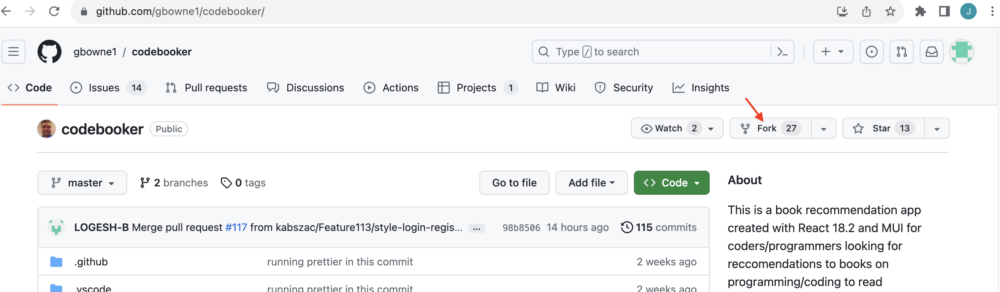
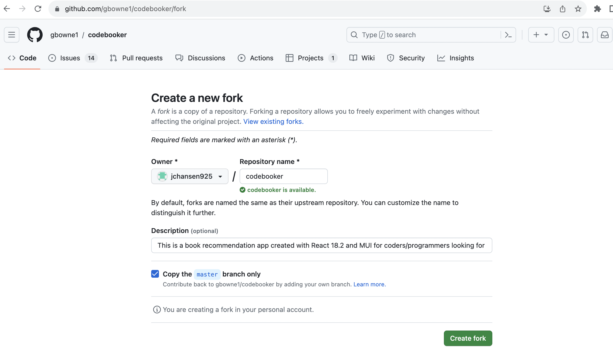
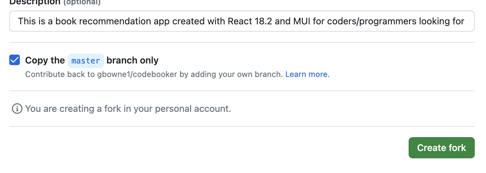
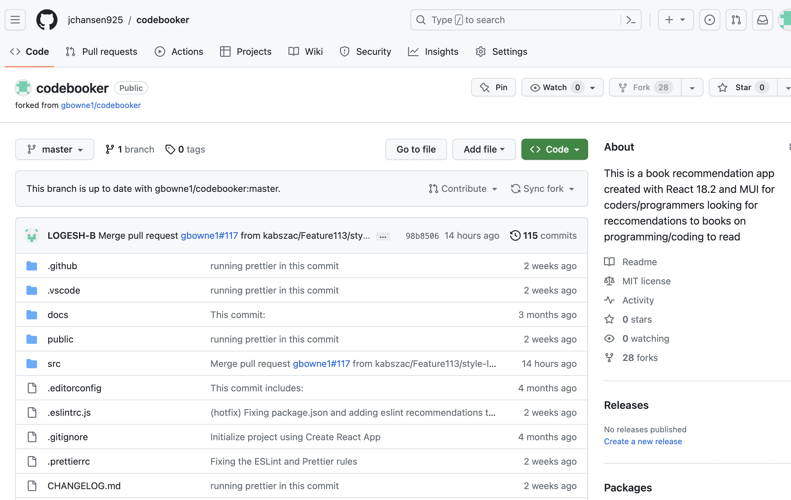

# Contributing to CodeBooker development

This project welcomes contributors to help improve its codebase by identifying shortcomings in the project, highlighting bugs, and issues in the documentation.

## What to contribute

Anyone with basic programming skills down to grammer skills can contribute immensely to this project.
Areas requiring contribution includes:

-   **Error checks**: Identify any mispellings or errors in documentation?

-   **Documentation**: Possess good documentation skills: Good spelling, punctuation, knowledge of Markdown and grammar checker tool, and you believe you can help elevate this projects' documentation even better?

-   **Code contribution**: Identify a bug in this app or thought of a new feature that could plunge this app to a new dimension?

## How to contribute

These next subheadings will get you started on making your contributions to this project.

## Select an issue

If you are not sure what to work on, review the issues list first. There are also TODO's listed in the included [TODO.md](./TODO.md) file.

@gbowne1 and other project maintainers will assign users to issues on a first come, first serve basis. If you would like to work on an issue, feel free to indicate by tagging the mentioned persons.

> Note: If assigned an issue and along the line you change your mind or can't figure it out, ensure to notify the team so it can be reassigned to another.   
> it is important to note that some tasks tagged good first issue may not be as simplified and basic to you as it might sound, so it is advisable to look through the issue thoroughly before volunteering.

## Create an issue

Have you noticed a feature that did not look or work right in our applicaton, or a typographical error, wrong syntax, grammar, spelling or other issue?

Check to see if an issue has been created for this in https://github.com/gbowne1/codebooker/issues

If none has been created, Click on the green [New Issue] button.

Describe your issue as well as you can:

-   Include code snippits where the issue lies.
-   Include screenshots (optional).
-   Include a short video (optional).

If the issue appears to be a browser, operating system, device specific issue, let us know what those are.

## Fork this repository

After choosing what to work on, move to fork and setup your own repository.

On the project's repository page, look to the right side of the page to locate a fork tab, click on this icon, and this would redirect you to a new page with further instructions.

On this next page, if satisfied with the suggested project name click on create fork.

Next,

This would automatically create your workspace/repository.

## Editor & IDE

The repository contains folders with project appropriate settings and configurations for Visual Studio code, but beyond that, we are tool and editor/IDE agnostic so you can use whatever editor or IDE or you like.

The [DEVSETUP](/docs/DEVSETUP.md) file contains instructions for developers on how to:

-   Clone or Fork the project,
-   Set up the project in their IDE or editor,
-   Set up their environment to work in the project, including any environment variables, yarn/npm/pnpm package(s), editor extensions or plugins needed,
-   Setting up the connection to the database,
-   Setting up the local development database, MongoDB.

## Prerequisites to use Database for programmers

Adequate knowledge and familiarity with React 17 and or 18, JavaScript ES5/ES6/ES7.

React gives us built-in hooks such as useEffect, useSelector, useRef, useHook, useCallback, useContext, useMemo, useForm, useHistory, etc. Ensure to make the most of these provided React built-ins.

Also, use accessibility (A11y) with themes and styles paying attention to focus styling, contrast and keyboard-accesibility.

Lastly, the browser gives us things like localStorage, IndexedDB, Session Storage, Cookies and Cache Storage.

## Pull Request

Once you are finished working on an issue move to create a Pull Request (PR).

When you create a PR on GitHub, make sure to complete the section on the right which includes:
Assignees, Reviewers, Labels, Projects, Milestone(s) and Development before you submit the PR.

Also, write a brief description of what you fixed. Keep in mind that Blank issues and PR's without a description of the changes you made may not get merged.

-   Link an issue to Development that the PR will close
-   Make sure that you tag a reviewer i.e. @gbowne1
-   Pick appropriate labels from Labels
-   Make sure you are the assignee to the PR.
-   Milestone, choose Frontend or Backend (more may come later on)

## Style

An official style guide is yet to be released. There is also no existing figma or layout, this is open to contribution, anyone willing to contribute to create this style guide is more than welcome, simply create a discussion and lets kickoff from there.

## Versioning

This project runs its application using Semantic Versioning (SemVer). [Keep a changelog](keepachangelog.com) also provides a CHANGELOG.md for the project; use the changelog document accordingly.

## Settings & Configuration

The included workspaces, settings, configurations and plugins are for:

-   Babel
-   Webpack
-   ESLint
-   Prettier
-   VSCode (.vscode)
-   GitHub (.github)

These may not be 100% correct, so we welcome any contribution to make them more accurate for React development, as we believe this will improve the new user first-hand experience working with our code base.

## Tech Stack

This project was bootstrapped with Create React App and built with:

-   React 18.2
-   JavaScript (ES5/ES6/ES7/ES2015/etc.)
-   NodeJS
-   ExpressJS
-   Material UI v5.11.6
-   Jest and React's testing-library for all testing
-   Prisma and/or MongoDB/Mongoose

All core components are built with JSX.

## Branches

Our branches follow GitFlow / GitHub Flow as a general rule.

-   [ main ] main working branch
-   [ master ] Permanent // Archive branch
-   [ test ] untested code
-   Feature Branch # of feature - {feature}
-   [bugfix - { fixed bug }]
-   [hotfix - { fix }]

Use a test branch to commit/push code that you believe should work but is not completely tested.
