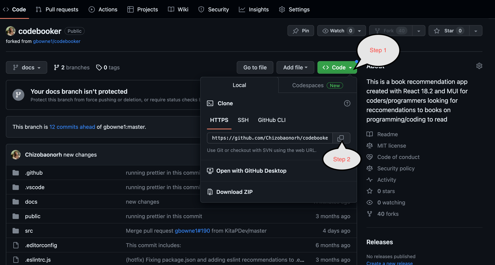

# Developer Environment Setup

This section contains information that will help you:

-   [Clone this project](#clone)
-   [Set up your working environment](#env)
-   [Set up the local development and connection to the database, MongoDB](#database)

## Getting Started with Create React App

This project was bootstrapped with [Create React App (CRA)](https://github.com/facebook/create-react-app).
This CRA allows developers to view the application in a web browser, make changes to the code, and see those changes reflected immediately without having to manually refresh the page. This feature is known as "hot reloading".

You can learn more in the [Create React App documentation](https://create-react-app.dev/docs/getting-started/).

To learn more about React, check out the [React documentation](https://react.dev/).

## Setting Up

It is advisable to work on this project using an IDE rather than through the github repository workspace; as this makes it easier to make changes to this project using git commands.

Follow these next steps to setup your local repository in your IDE.

## Clone this repository <a name="clone"></a>

This simply means replicating the files in this project in your IDE workspace.

### Step 1

Navigate to your forked repository, on the left side of your screen click on the drop down with "code" written on it. This will pop up a small dialog box; make no changes to this box but simply copy the url.



### Step 2

Create a folder on your computer and open this folder in your IDE. Open the terminal in your IDE and cd into this folder

To clone the remote repository to your desktop repository, run the command

```
git clone "paste-the-link-you-copied-from-the-forked-repository"
```

for example,

```
git clone https://github.com/Chizobaonorh/codebooker.git
```

## Setup up working environment<a name="env"></a>

After cloning this repository, create your feature branch where you commit changes you make before merging into the main branch.

### Step 1

Create your feature branch using

```
git checkout -b "feature-branch"
```

### Step 2

After this, install dependencies by running

```
npm i

```

Next run,

```
npm start
```

Runs the app in the development mode.
Open [http://localhost:3000](http://localhost:3000) to view it in your browser. The page will reload when you make changes. You may also see any lint errors in the console.

Then,

```
npm test
```

Launches the test runner in the interactive watch mode. See the section about [running tests](https://facebook.github.io/create-react-app/docs/running-tests) for more information.

Finally,

```
npm run eject
```

**Note: this is a one-way operation. Once you `eject`, you can't go back!**

If you aren't satisfied with the build tool and configuration choices, you can `eject` at any time. This command will remove the single build dependency from your project.

Instead, it will copy all the configuration files and the transitive dependencies (webpack, Babel, ESLint, etc) right into your project so you have full control over them. All of the commands except `eject` will still work, but they will point to the copied scripts so you can tweak them.

## Setup Database and Connection <a name="database"></a>

Local Environment Requirements: MongoDB and Node.js

1. **Install MongoDB:**

    - Install MongoDB either locally or use MongoDB Atlas (MongoDB's cloud-based service).
    - If installing locally, visit the MongoDB website (https://www.mongodb.com/try/download/community) and download the appropriate version for your operating system.
    - Follow the installation instructions for your OS to set up MongoDB.

2. **Create an Environment File:**

    - Create a file named `.env` in the root directory of your Node.js application.
    - Open the `.variable.env` file, copy its contents, and paste them into your newly created `.env` file.

3. **Configure the Environment Variables:**

    - In the `.env` file, you'll find configuration variables. Make sure to set the following:
        - `PORT`: This should be the port number where your Node.js application will run (e.g., `3000`).
        - `MONGODB_URI`: This should be the URL for your MongoDB instance. If you're using MongoDB locally, it might look like `mongodb://localhost:27017/your-database-name`.

4. **Run the Setup Script:**

    - Inside your project folder, you may have a folder named `setup`.
    - Run the `setup.js` file located in that folder. This script is responsible for creating a dummy user in your MongoDB database.
    - After running the setup script, it should display a message like "User created (email: 'test@gmail.com' password: 'test')."

5. **Start the Node.js Server:**
    - Now that you have MongoDB set up and the dummy user created, you can start your Node.js server.
    - Run the `index.js` file or the main entry point of your Node.js application to start the server. You can do this using the `node` command.
        ```
        node index.js
        ```
    - Your Node.js server should now be running, and it will connect to the MongoDB database using the URL and credentials specified in your `.env` file.

With these steps completed, you should have MongoDB set up, environment variables configured, a dummy user created, and your Node.js server running. You can now start developing and testing your application locally.

You can login in the website with this ( username: "test" email: "test@gmail.com" password: "test")
